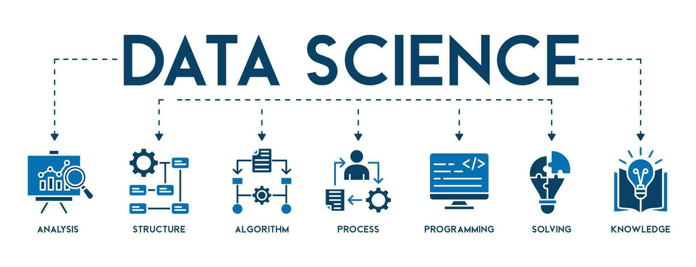

<h1 align="center">Hi 👋, I'm Harsh Gupta</h1>
<h3 align="center">Aspiring Data Scientist</h3>

  

- 🔭 I’m currently working on **tinyGPT** https://github.com/2003HARSH/tinyGPT

- 🌱 I’m currently learning **Retrieval Augmented Generation (RAG)**

- 🤝 I’m looking for help with **tinyGPT** https://github.com/2003HARSH/tinyGPT 

- 👨‍💻 All of my projects are available at [https://2003harsh.github.io/](https://2003harsh.github.io/)

- 💬 Ask me about **Machine Learning , Deep Learning ,Natural Language Processing (NLP), Large Language Models (LLMs) & Retrieval Augmented Generation (RAG) and Fine-Tuning**

- 📫 How to reach me **harshnkgupta@gmail.com**

- 📄 Know about my experiences [https://2003harsh.github.io/](https://2003harsh.github.io/)

<h3 align="left">Connect with me:</h3>

<h3 align="left">Languages and Tools:</h3>

               

